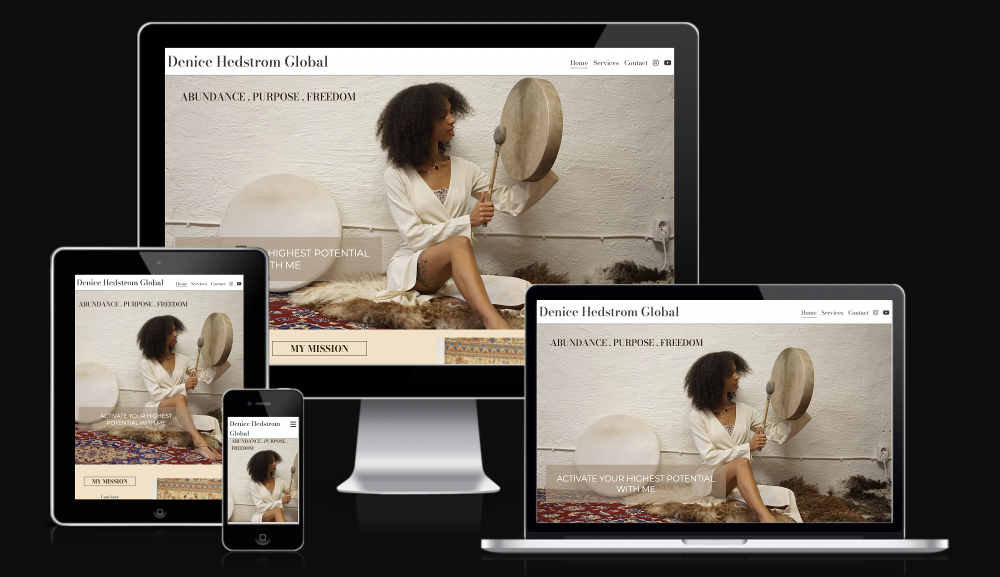
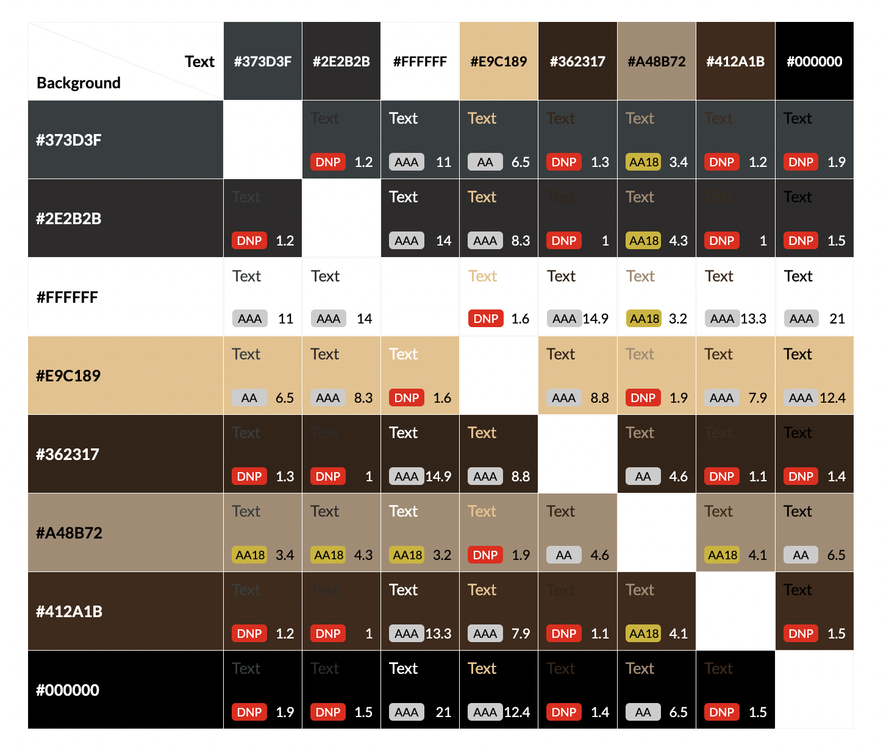
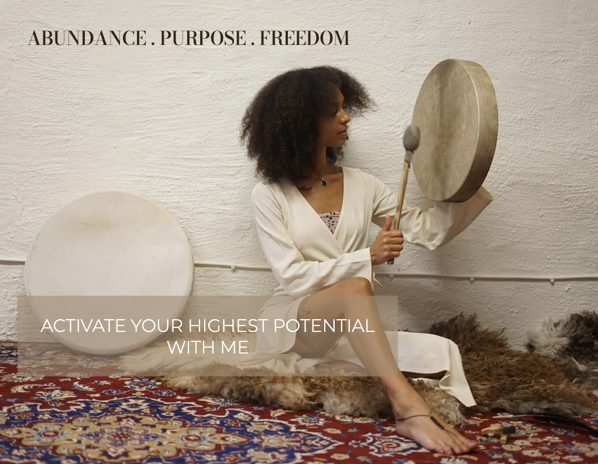
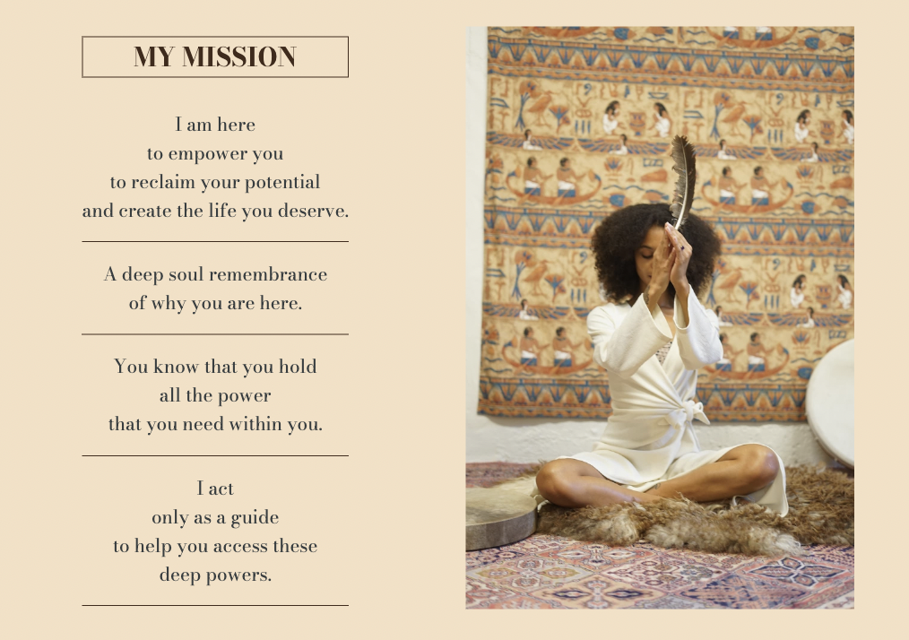
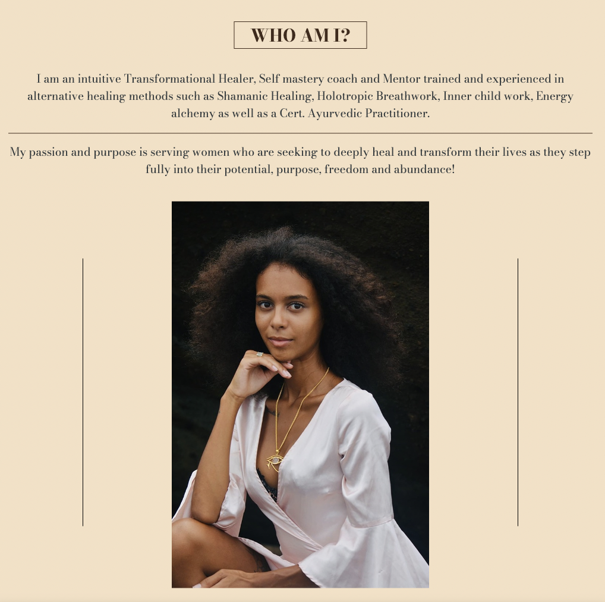
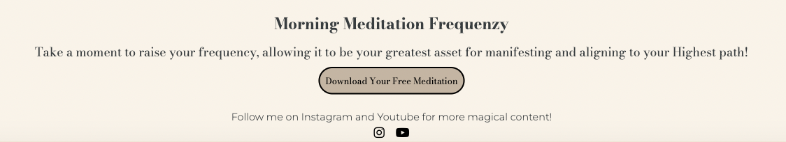
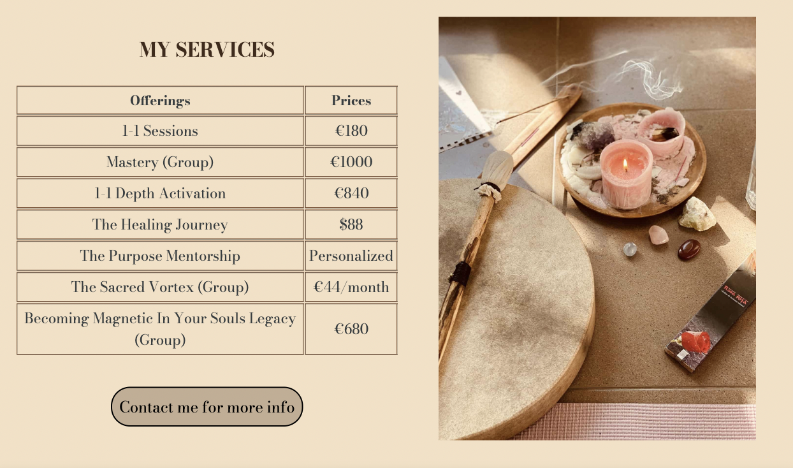
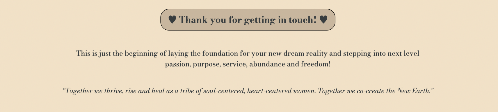
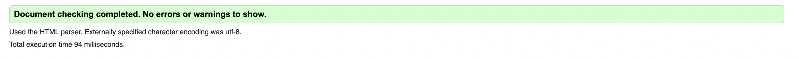
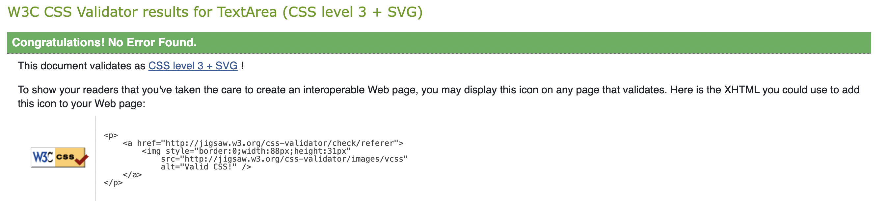

# Denice Hedstrom Global

## Introduction

This site was created for the magical healer Denice Hedstrom. It aims to highlight who she is and what she brings to the world in her work for the purpose of manifesting women who deeply need her guidance and support to level up their lives and unshackle trauma and doubts that hold them back. 

This site hopes to be an invitation for women (of course, men are always welcome too!) looking for a change in their reality and a connecting portal for Denice and future clients.

Link to the live site here - [Denice Hedstrom](https://mayamariaruth.github.io/denice-hedstrom/)

## Table of Contents:
1. [**Introduction**](#introduction)
1. [**Design**](#Design)
    * [***Target audience***](#target-audience)
    * [***User Stories***](#user-stories)
    * [***Site aims***](#site-aims)
    * [***Color scheme***](#color-scheme)
    * [***Typography***](#typography)
1. [**Features**](#Features)
    * [***Navigation bar***](#navigation-bar)
    * [***Hero image***](#hero-image)
    * [***My mission***](#my-mission-section)
    * [***About me***](#about-me-section)
    * [***Footer***](#the-footer)
    * [***Services***](#services)
    * [***Contact***](#contact)
    * [***Contact feedback***](#contact-feedback)
    * [***Future features***](#future-features)
1. [**Testing**](#testing)
    * [***Validator testing***](#validator-testing)
1. [**Deployment**](#deployment)
1. [**Bugs**](#bugs)
    * [***Fixed Bugs***](#fixed-bugs)
    * [***Unfixed Bugs***](#unfixed-bugs)
1. [**Credits**](#credits)
    * [***Code***](#code)
    * [***Content***](#content)
    * [***Media***](#media)
    * [***General reference***](#general-reference)

## Design

### Target audience 

* Women who are needing a change in their lives.
* Women who are drawn to spirituality and alternative medicine/practices.
* Women who are looking for a mentor and community.
* Women who have tried going the 'normal' route (doctors and therapists) but are now searching for other ways of healing.

### User stories

### Site aims 

### Client design wishes

* A simple and clean website that reflects who she is as a person and as a professional practitioner in the healing sphere.
* Colors consisting of pastel shades of gold/yellow which is her favourite color.
* Access to her free content, which is incredibly important for her brand to stay accessible for all.
* Specific images chosen by her.

### Color scheme
The client had requested pastel shades of gold/yellow and a simple website so I went with below colors of gold/yellow and brown for the site and black/dark brown for texts. 
I utilized the Contrast grid by Eightshapes to test my color combos so the colors complied with the highest accessibility.

### Typography
I used two different fonts across the page:
 * Bodoni Moda, which was the main one used for most content.
 * Montserrat, used for a text in the footer.

I wanted to keep it simple and with the different font-weights, heading styles and sizes, Bodoni Moda was enough to give the texts a variation.

The fonts were sourced from Google Fonts.

## Features 

### Navigation Bar

  - The navigation bar can be seen on all three main pages, as well as on the fourth contact form feedback page. 
  - It features the title with a link to the home page, home page, services page, contact page and social media links for easy access.
  - For mobile, it features a toggle button in the shape of a 'burger' (three horizontal lines icon) that is fully responsive when clicked, exposing and/or hiding the navigation bar. 
  - This feature is crucial for easy navigation on the page and to highlight the different sections available.

  

### Hero image

- The hero image section consists of an image of Denice in action during a retreat banging on a shamanic drum she calls Luna. It's meant to immediately capture the user with the harmonius energy felt from the image, as well as showcase her work as a Shaman.
- It also consists of two text overlays which explain the purpose of the work Denice does, making it easier to catch the eye of the people who are there for 'Abundance. Purpose. Freedom'.

### My Mission section

- This sections aim is very straightforward I would say, to give a brief statement of what Denice's 'mission' is with her work and what she aims to achieve with every client in her space.
- This will also catch the eye of the people who resonate with the work she does.
- It features an image of her praying with a feather (which is an item she works a lot with for healings).

### About Me section

- This section is also very self-explanatory, it shares a brief story about Denice's life and her passion for her work, which is very important for a more personal feel to the site and to invite users to get a deeper understanding of Denice.
- It features a more portrait style picture of Denice, perfectly fitting the more personal section.

### Footer

- The footer is very much in line with the theme of the site and it allows users to access a free meditation by Denice. 
- It features a short encouraging text and a button that takes users to a Google Drive link with a free meditation, this is a great way to give users a preview of Denice's work and allow them to connect with her indirectly which can help them decide if they feel safe doing healing work with her.
- The footer also consists of social media links with a short text letting users know there is more magical content to be found.

### Services

- This page highlights her 'offerings' and their prices, these are the different programs or services she has available to clients. There is also a button to contact her for more information, which takes the user to the Contact page.
- It also features an image of the regular tools she uses for her sessions, which flows very well with the content of the page.
- This page is, of course, very crucial to showcase her different services and allow users to contact her to start working together.

### Contact

- The contact page consists of a contact form where users can fill in their names, emails, a subject, a message (with longer text input) and a 'submit' button.
- There is also a very fitting image alongside the form that shows Denice smiling and giving thanks.
- This page is very important to allow users to be able to contact Denice and for Denice to be able to sign new clients up.

### Contact feedback

- This is the page the users are taken to when they press the 'submit' button on the contact form. It has a cute little 'thank you' note with a quote to be a little bit less formal and send some good energy to the users.
- It has all the same features as the other pages so the user can continue scrolling on the site if they wish.
- This provides a better user experience and it gives off a good energy, which is very important for a site for a healer.

### Future features

__My mission section__
- For larger screens, I would use Flexbox and move the first paragraph to the left and the one under it to the right and so on. To take up some more space and give it a new look. 

__About me section__
- For larger screens, I would use Flexbox and move a part of the text next to the image to fill up some more space and create a more even layout.

__Services page__
- I would add more content to explain shortly what the different offerings entail and give them all a section each on the page. For a bigger project, I would create a separate page for each offering and have buttons linking to Denice's calendly instead for direct booking.

__Contact page__
- I would change the background to an image to make the page look a bit more playful, it looks a bit simple at the moment.

__Thank you page__
- I would add a link to one of Denice's youtube videos for more free content and exposure to Denice's work.

## Testing 

In this section, you need to convince the assessor that you have conducted enough testing to legitimately believe that the site works well. Essentially, in this part you will want to go over all of your project’s features and ensure that they all work as intended, with the project providing an easy and straightforward way for the users to achieve their goals.

In addition, you should mention in this section how your project looks and works on different browsers and screen sizes.

You should also mention in this section any interesting bugs or problems you discovered during your testing, even if you haven't addressed them yet.

If this section grows too long, you may want to split it off into a separate file and link to it from here.

### Validator Testing 

- HTML
  - No errors were returned when passing through the official W3C validator 

- CSS
  - No errors were found when passing through the official Jigsaw validator 

## Deployment

To deploy the site to Github pages, I went through below steps: 
- Go to the Settings tab of the project's Github repository.
- There is a General menu on the left side of the screen, go to Code & Automation and click Pages.
- Scroll down to the Build & Deployment section and choose the Source 'Deploy from a branch'.
- Below this, you choose the Branch 'Main' and the Folder '/root'.
- Press Save and go back to the Code page of your repository.
- After a couple minutes, refresh the page and the succesfully deployed site will be found on the right hand side of the page under 'Deployments' with the name "Github pages".

Live link to the site - https://mayamariaruth.github.io/denice-hedstrom/

## Bugs

### Fixed Bugs

### Unfixed Bugs

You will need to mention unfixed bugs and why they were not fixed. This section should include shortcomings of the frameworks or technologies used. Although time can be a big variable to consider, paucity of time and difficulty understanding implementation is not a valid reason to leave bugs unfixed. 

## Credits 

### Code 

_Code Institute's Love Running Project credit_
- The navigation toggle button.
- Using the Main section to push the footer down.

_External pages credit_
- I draw help from [W3Schools](https://www.w3schools.com/html/html_table_borders.asp) for the table on the services page.
- The lines on either side of the image in the About Me section was drawn from [Daniel Vassallo's comment on Stackoverflow](https://stackoverflow.com/questions/3148415/how-to-make-a-vertical-line-in-html#:~:text=You%20can%20draw%20a%20vertical,width%20with%20any%20html%20element.&text=The%20width%20property%20determines%20the,the%20color%20of%20the%20line.).

### Content 

- The texts for the home page were provided by the client Denice Hedstrom.
- The offerings on the services page were provided by Denice Hedstrom.
- The social media links were provided by Denice Hedstrom and link to her real Instagram page and Youtube channel.
- The contact form is a mock form that opens a fourth page with a thank you note.
- The icons in the footer/navigation bar were taken from [Font Awesome](https://fontawesome.com/)
- The meditation link in the footer was shared by Denice Hedstrom.

### Media

- The images used on the home page, services page and contact page were provided by Denice Hedstrom.
- [RedKetchup](https://redketchup.io/image-resizer) was used to resize images.
- 
- 
- 

### General reference

- I relied upon my code learnings from the Code Institute, as well as the walk-through of the Love Running project. There can be some similiarities in the code but I credited the sections where the code didn't deviate fully.
- W3Schools and StackOverflow were the ones mostly used for external references, offering much needed explanations and inspirations. 

